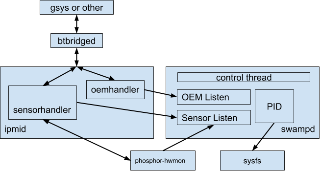

# phosphor-pid-control

[TOC]

## Objective

Develop a tray level fan control system that will use exhaust temperature and
other machine temperature information to control fan speeds in order to keep
machines within acceptable operating conditions.

Effectively porting the Chromium EC thermal code to run on the BMC and use the
OpenBMC dbus namespace and IPMI commands.

## Background

Recent server systems come with a general secondary processing system attached
for the purpose of monitoring and control, generally referred to as a BMC[^2].
There is a large effort to develop an open source framework for writing
applications and control systems that will run on the BMC, known as
OpenBMC[^3]<sup>,</sup>[^4]. Within Google the effort has been internalized
(while also providing upstream pushes) as gBMC[^5]. The primary goal of OpenBMC
is to provide support for remote and local system management through a REST
interface, and also through IPMI[^6] tied together via the system dbus. OpenBMC
provides many applications and daemons that we can leverage and improve.

The BMC is wired such that it has direct access and control over many
motherboard components, including fans and temperature sensors[^7]. Therefore,
it is an ideal location to run a thermal control loop, similar to the EC.
However, to upstream it will need to follow (as best as possible) the OpenBMC
specifications for communicating and executing[^8].

IPMI allows for OEM commands to provide custom information flow or system
control with a BMC. OEM commands are already lined up for certain other accesses
routed through the BMC, and can be upstreamed for others to use.

## Overview

The BMC will run a daemon that controls the fans by pre-defined zones. The
application will use thermal control, such that each defined zone is kept
within a range and adjusted based on thermal information provided from locally
readable sensors as well as host-provided information over an IPMI OEM
command.

A system (or tray) will be broken out into one or more zones, specified via
configuration files or dbus. Each zone will contain at least one fan and at
least one temperature sensor and some device margins. The sensor data can
be provided via sysfs, dbus, or through IPMI. In either case, default margins
should be provided in case of failure or other unknown situation.

The system will run a control loop for each zone with the attempt to maintain
the temperature within that zone within the margin for the devices specified.

## Detailed Design

The software will run as a multi-threaded daemon that runs a control loop for
each zone, and has a master thread which listens for dbus messages.  Each zone
will require at least one fan that it exclusively controls, however, zones can
 share temperature sensors.



In this figure the communications channels between swampd and ipmid and
phosphor-hwmon are laid out.

### OpenBMC Upstream

To be upstreamed to OpenBMC for use on open-power systems, we need to follow the
OpenBMC code style specification[^9] and leverage the dbus framework for reading
sensors and fan control[^10].

There is already a daemon, which given a configuration file for a hwmon device,
will add it to the dbus objects namespace which handles queries for values such
a temperature or fan speed and allows another process to control the fan
speed[^11]. It is the goal to utilize this other daemon through dbus to read the
onboard sensors and control the fans.

Because of the present implementation of the dbus interfaces to require
controlling the fans only via specifying the RPM target, whereas the driver
we're using for Quanta-Q71l (the first system) only allows writing PWM.  This
can be controlled either directly or via dbus.

### Zone Specification

A configuration file will need to exist for each board, likely in YAML[^12].
Similar information will also be necessary for gsys, such that it knows what
sensors to read and send to the BMC. Presently it does something similar with
EC, so it shouldn't be unreasonable to do something similar.

Each zone must have at least one fan that it exclusively controls. Each zone
must have at least one temperature sensor, but they may be shared.

The external devices specified in the zone must have default information as a
fallback, while their current temperatures will be provided by gsys. Some
devices adapt quickly and others slowly, and this distinction will need to be a
factor and described in the configuration.

The internal thermometers specified will be read via sysfs.

#### A proposed configuration file:

```
{ZONEID}:
  {PIDID}:
    type: "fan" | "margin"
    ipmi:
      {IPMI_ID}
      name: "fan1"
      readpath: "/xyz/openbmc_project/sensors/fan_tach/fan1"
      writepath: "/sys/class/hwmon/hwmon0/pwm0"
    pidinfo:
      samplerate: 0.1 // sample time in seconds
      p_coeff: 0.01 // coefficient for proportional
      i_coeff: 0.001 // coefficient for integral
      integral_limit:
        min: 0
        max: 100
      output_limit:
        min: 0
        max: 100
      slew_negative: 0
      slew_positive: 0
  {PIDID}:
    type: "margin"
    ipmi:
      {IPMI_ID}
      name: "sluggish0"
      readpath: "/xyz/openbmc_project/sensors/external/sluggish0"
      writepath: ""
    pidinfo:
      samplerate: 1 // sample time in seconds
      p_coeff: 94.0
      i_coeff: 2.0
      integral_limit:
        min: 3000
        max: 10000
      output_limit:
        min: 3000
        max: 10000
      slew_negative: 0
      slew_positive: 0
```

### Chassis Delta

Due to data center requirements, the delta between the outgoing air temperature
and the environmental air temperature must be no greater than 15C.

### IPMI Command Specification

Gsys needs the ability to send to the BMC, the margin information on the devices
that it knows how to read that the BMC cannot. There is no command in IPMI that
currently supports this use-case, therefore it will be added as an OEM command.

The state of the BMC readable temperature sensors can be read through normal
IPMI commands and is already supported.

#### OEM Set Control

Gsys needs to be able to set the control of the thermal system to either
automatic or manual. When manual, the daemon will effectively wait to be told to
be put back in automatic mode. It is expected in this manual mode that something
will be controlling the fans via the other commands.

Manual mode is controlled by zone through the following OEM command:

##### Request

Byte | Purpose      | Value
---- | ------------ | -----------------------------------------------------
`00` | `netfn`      | `0x2e`
`01` | `command`    | `0x04 (also using manual command)`
`02` | `oem1`       | `0xcf`
`03` | `oem2`       | `0xc2`
`04` | `padding`    | `0x00`
`05` | `SubCommand` | `Get or Set. Get == 0, Set == 1`
`06` | `ZoneId`     |
`07` | `Mode`       | `If Set, Value 1 == Manual Mode, 0 == Automatic Mode`

##### Response

Byte | Purpose   | Value
---- | --------- | -----------------------------------------------------
`02` | `oem1`    | `0xcf`
`03` | `oem2`    | `0xc2`
`04` | `padding` | `0x00`
`07` | `Mode`    | `If Set, Value 1 == Manual Mode, 0 == Automatic Mode`

#### OEM Get Failsafe Mode

Gbmctool needs to be able to read back whether a zone is in failsafe mode. This
setting is read-only because it's dynamically determined within Swampd per zone.

Byte | Purpose      | Value
---- | ------------ | ----------------------------------
`00` | `netfn`      | `0x2e`
`01` | `command`    | `0x04 (also using manual command)`
`02` | `oem1`       | `0xcf`
`03` | `oem2`       | `0xc2`
`04` | `padding`    | `0x00`
`05` | `SubCommand` | `Get == 2`
`06` | `ZoneId`     |

##### Response

Byte | Purpose    | Value
---- | ---------- | -----------------------------------------------
`02` | `oem1`     | `0xcf`
`03` | `oem2`     | `0xc2`
`04` | `padding`  | `0x00`
`07` | `failsafe` | `1 == in Failsafe Mode, 0 not in failsafe mode`

#### Set Sensor Value

Gsys needs to update the thermal controller with information not necessarily
available to the BMC. This will comprise of a list of temperature (or margin?)
sensors that are updated by the set sensor command. Because they don't represent
real sensors in the system, the set sensor handler can simply broadcast the
update as a properties update on dbus when it receives the command over IPMI.

#### Set Fan PWM

Gsys can override a specific fan's PWM when we implement the set sensor IPMI
command pathway.

#### Get Fan Tach

Gsys can read fan_tach through the normal IPMI interface presently exported for
sensors.

### Sensor Update Loop

The plan is to listen for fan_tach updates for each fan in a background thread.
This will receive an update from phosphor-hwmon each time it updates any sensor
it cares about.

By default phosphor-hwmon reads each sensor in turn and then sleeps for 1
second. We'll be updating phosphor-hwmon to sleep for a shorter period -- how
short though is still TBD. We'll also be updating phosphor-hwmon to support pwm
as a target.

### Thermal Control Loops

Each zone will require a control loop that monitors the associated thermals and
controls the fan(s). The EC PID loop is designed to hit the fans 10 times per
second to drive them to the desired value and read the sensors once per second.
We'll be receiving sensor updates with such regularly, however, at present it
takes ~0.13s to read all 8 fans. Which can't be read constantly without bringing
the system to its knees -- in that all CPU cycles would be spent reading the
fans. TBD on how frequently we'll be reading the fan sensors and the impact this
will have.

### Main Thread

The main thread will manage the other threads, and process the initial
configuration files. It will also register a dbus handler for the OEM message.

### Enabling Logging

By default, swampd isn't compiled to log information. To compile it for tuning,
you'll need to add:

```
EXTRA_OEMAKE_append_YOUR_MACHINE = " CXXFLAGS='${CXXFLAGS} -D__TUNING_LOGGING__'"
```

To the recipe.

## Project Information

This project is designed to be a daemon running within the OpenBMC environment.
It will use a well-defined configuration file to control the temperature of the
tray components to keep them within operating conditions. It will require
coordinate with gsys and OpenBMC. Providing a host-side service upstream to talk
to the BMC is beyond the scope of this project.

## Security Considerations

A rogue client on the host could send invalid thermal information causing
physical damage to the system. There will be an effort to sanity check all input
from gsys to alleviate this concern.

## Privacy Considerations

This device holds no user data, however, you could profile the types of jobs
executed on the server by watching its temperatures.

## Testing Plan

Testing individual code logic will be handled through unit-tests, however some
pieces of code rely on abstractions such that we can swap out dbus with
something encapsulated such that testing can be done without strictly running on
a real system.

Testing the system on real hardware will be performed to verify:

1.  The fallback values are used when gsys isn't reporting.
1.  The system behaves as expected given the information it reads.

Unit-tests will provide that we know it validates information from gsys properly
as well as handles difficult to reproduce edge cases.

The testing of this project on real hardware can likely fold into the general
gBMC testing planned.

## Notes

[^2]: BMC - Board Management Controller
[^3]: with url https://github.com/openbmc/openbmc
[^4]: with url https://github.com/facebook/openbmc
[^5]: with url http://go/gbmc
[^6]: with url
    http://www.intel.com/content/www/us/en/servers/ipmi/ipmi-second-gen-interface-spec-v2-rev1-1.html
[^7]: Excluding temperature sensors on PCIe cards and other add-ons.
[^8]: They prefer c++.
[^9]: With url
    https://github.com/openbmc/docs/blob/master/cpp-style-and-conventions.md
[^10]: with url https://github.com/openbmc/phosphor-dbus-interfaces
[^11]: with url https://github.com/openbmc/phosphor-hwmon
[^12]: YAML appears to be the configuration language of choice for OpenBMC.
